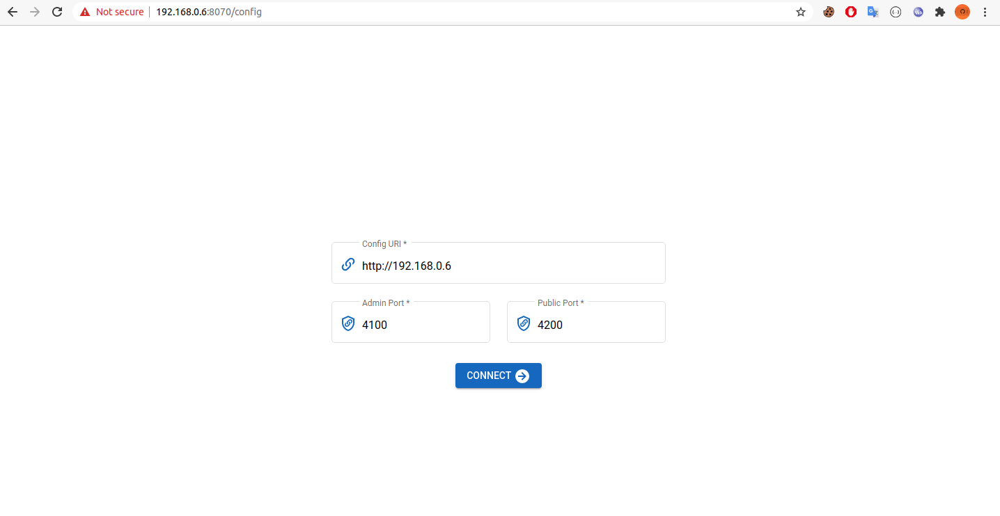
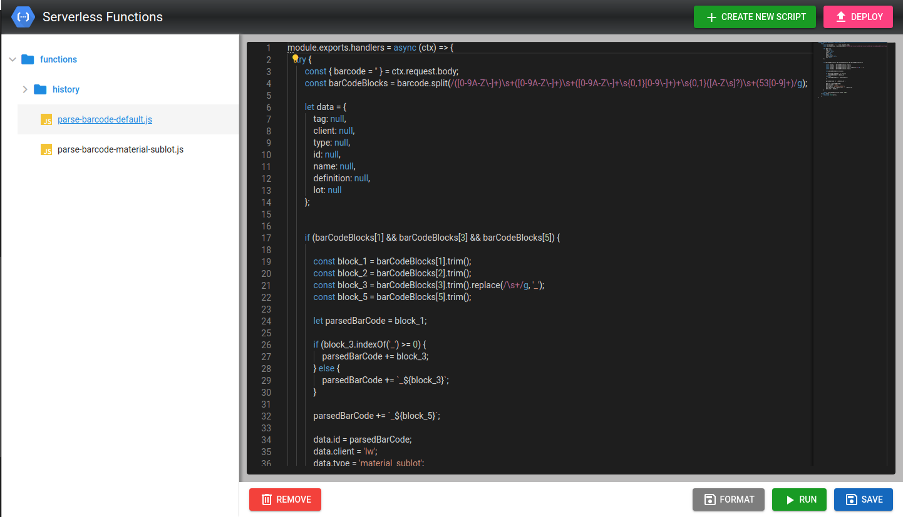

# Serverless-Function
## Introduce
- This service is a serverless function for custom API on customer (ex: parse barcode api...);

## Setup Guide

### Volumes
- gluterfsPath:/core/functions (recommend using gluterfs);


### Setup backend
#### image: 

### Traefik path config
- domain: 
- pathPrefix: /api/function_invocations/
- public port: Admin port (for UI setting function).

#### Environment

<table style="width:100%">
  <tr>
    <th style="text-align:left" >Name</th>
    <th style="text-align:left" >Default</th>
    <th style="text-align:left" >Require</th>
    <th style="text-align:left" >Description</th>
  </tr>
  <tr>
    <td>ADMIN_PORT (public)</td>
    <td>4100</td>
    <td>true</td>
    <td>Public this port for UI setting</td>
  </tr>
  <tr>
    <td>API_PORT (public)</td>
    <td>4200</td>
    <td>true</td>
    <td>Mapping this port for traefik router with path prefix /api/function_invocations/</td>
  </tr>
  <tr>
    <td>ENABLE_BASIC_AUTH</td>
    <td>false</td>
    <td>fasle</td>
    <td>Temporary disable</td>
  </tr>
  <tr>
    <td>ADMIN_USER</td>
    <td>null</td>
    <td>fasle</td>
    <td>For basic auth enable</td>
  </tr>
  <tr>
    <td>ADMIN_PASSWORD</td>
    <td>null</td>
    <td>fasle</td>
    <td>For basic auth enable</td>
  </tr>
</table>

#### Testing
```
Request: curl --location --request GET /api/function_invocations/home'
Response: 
{
    "success": true,
    "data": "Serverless function api homepage!"
}
```


### Setup UI
#### Setup: 
- /deploy/registry-container/frontend-serverless-functions:1.0.0
- PORT: 8070:8070

#### Test
- After setup backend and UI. Acess to http://HOST_IP_ADRESS:8070
- Response look like.

- Then input Config URI: http://HOST_IP_ADRESS
- Admin port: ADMIN_PORT
- Public port: API_PORT
- UI Runing:


#### Create first function
- First Click 'Create New Script' and input function name (ex: hello_world) then click funcion_name on left screen.
- Input test
```
const moment = require('moment');

module.exports.handlers = async (ctx) => {
    const name = ctx.query.name || "none";
    return ctx.showResult(ctx, `${ Hello ${name}. Now is ${moment()}}`, 200);
};
```
- Click save. Then click Deploy
- Testing
```
Request:
curl --location --request GET '/api/function_invocations/hello_world?name=%22Tien%22'

Response
{
    "success": true,
    "data": "Hello \"Tien\". Now is Fri Aug 07 2020 04:37:01 GMT+0000."
}
```
